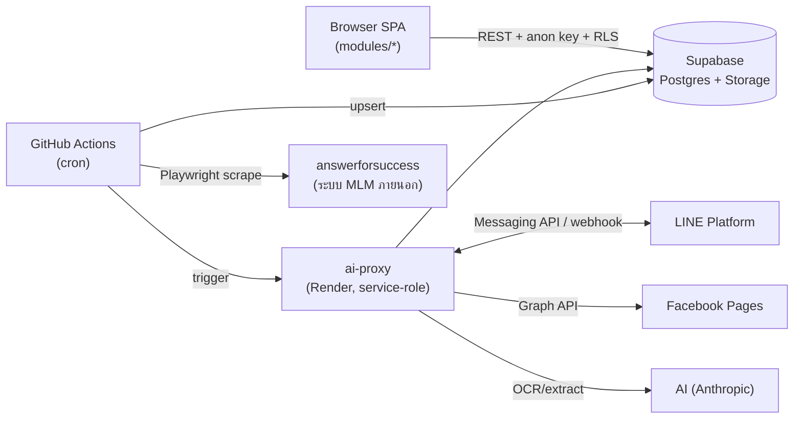
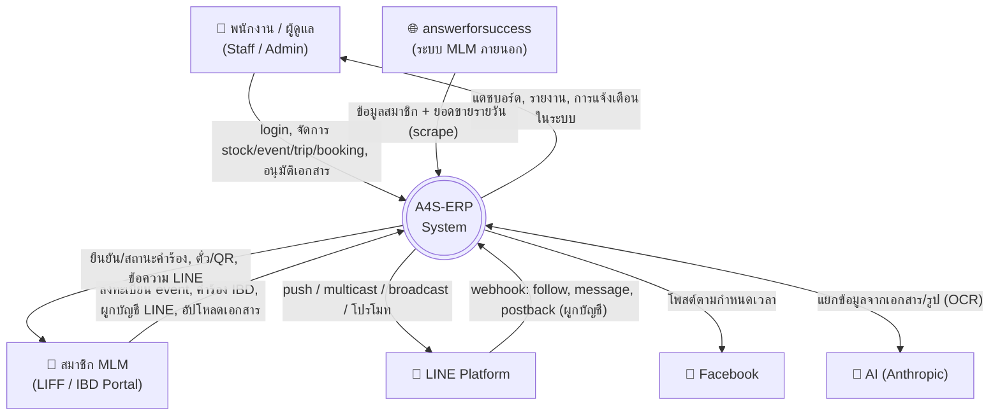
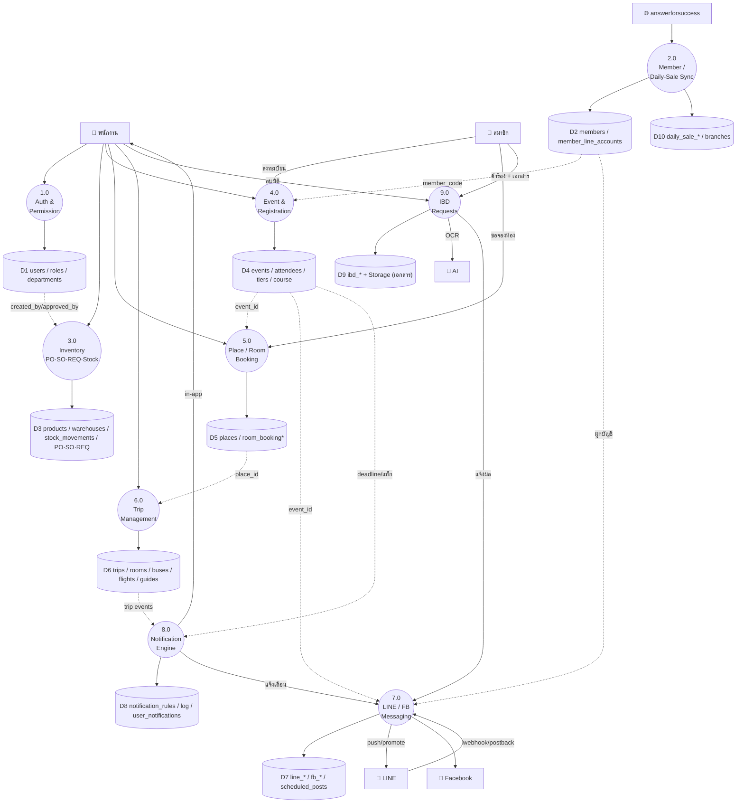
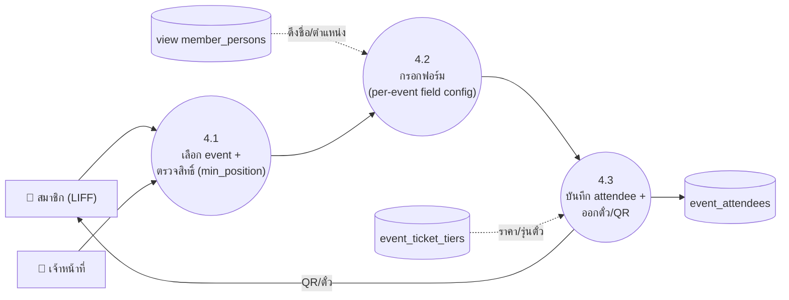
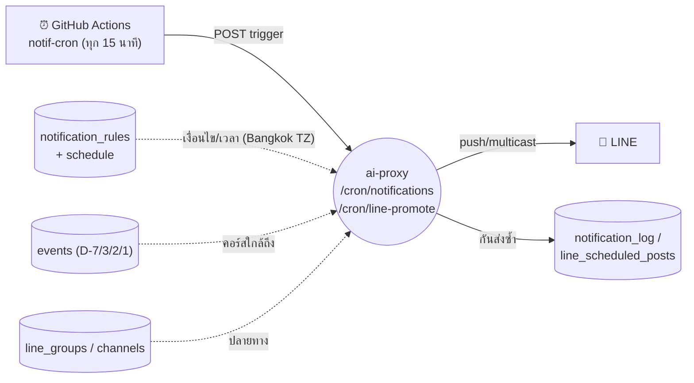
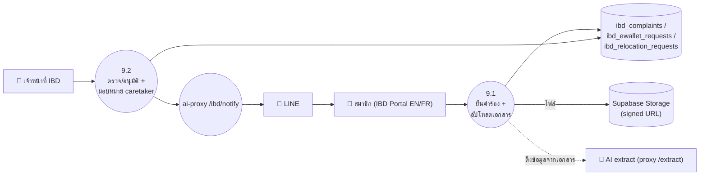

# A4S-ERP — Data Flow Diagram (DFD)

> สร้างจากโครงสร้างจริง: `modules/*` (SPA → Supabase), `ai-proxy/server.js` (backend บน Render),
> `scripts/sync-*.js` (Playwright), `.github/workflows/*.yml` (cron) + schema ใน [ER-diagram.md](ER-diagram.md)
> เปิดดูด้วย Mermaid preview (VSCode extension "Markdown Preview Mermaid Support" หรือบน GitHub)

**สัญลักษณ์ (Gane–Sarson style บน Mermaid):**
- `[ผู้ใช้ภายนอก]` สี่เหลี่ยม = External Entity
- `((กระบวนการ))` วงกลม = Process
- `[(Data Store)]` ทรงกระบอก = แหล่งเก็บข้อมูล (ตาราง Supabase / Storage)

---

## สถาปัตยกรรมโดยย่อ (ก่อนเข้า DFD)



จุดสำคัญ: SPA คุยกับ Supabase ตรง ๆ (อ่าน/เขียนงานทั่วไป) ส่วนงานที่ต้อง **service-role / secret / 3rd-party** (ส่ง LINE, FB, AI, cron) วิ่งผ่าน **ai-proxy** เสมอ

---

## Level 0 — Context Diagram

ระบบทั้งหมดมองเป็นกล่องเดียว เห็นเฉพาะ external entity + data flow หลัก



---

## Level 1 — กระบวนการหลัก + Data Stores

แตกกล่อง "A4S-ERP System" เป็นกระบวนการหลัก พร้อม data store (กลุ่มตาราง)



---

## Level 2 — ขยายกระบวนการสำคัญ

### 2.1 Member / Daily-Sale Sync (Process 2.0)
GitHub Actions cron → Playwright เปิด answerforsuccess → upsert เข้า Supabase (service-role)

```mermaid
flowchart LR
    CRON["⏰ GitHub Actions<br/>members: รายชั่วโมง<br/>daily-sale: ชม.ละครั้ง (1–13)"]
    AFS["🌐 answerforsuccess"]
    P2a(("2.1<br/>scrape members<br/>(sync-members.js)"))
    P2b(("2.2<br/>scrape ยอดขาย<br/>(sync-daily-sale.js)"))
    D2[("members")]
    DS[("daily_sale_bills / payments<br/>topup / reconcile")]

    CRON --> P2a
    CRON --> P2b
    AFS -->|HTML/xls + login| P2a
    AFS -->|4 ไฟล์ xls| P2b
    P2a -->|upsert (1-year buckets)| D2
    P2b -->|upsert + business_date| DS
```

### 2.2 Event Registration (Process 4.0)
สมาชิกลงทะเบียนผ่าน LIFF/ฟอร์ม → ผูกกับ member_code → ตรวจ tier/qualification



### 2.3 LINE Notification & Promote (Process 7.0 + 8.0)
cron ยิงเข้า ai-proxy ทุก 15 นาที → ประเมิน rule/กำหนดการ → ส่ง LINE



### 2.4 LINE Account Linking (webhook)
สมาชิกแอด/ส่งข้อความ → webhook → จับคู่ member_code ↔ line_user_id

```mermaid
flowchart LR
    MEMBER["🧑 สมาชิก"]
    LINE["💬 LINE Platform"]
    PROXY(("ai-proxy<br/>/line/webhook"))
    TOK[("line_link_tokens /<br/>line_verify_sessions")]
    ACC[("member_line_accounts /<br/>users.line_*")]

    MEMBER -->|follow / ข้อความ / postback| LINE
    LINE -->|webhook event| PROXY
    PROXY <-->|ตรวจ token| TOK
    PROXY -->|บันทึก binding| ACC
    PROXY -->|ตอบกลับ (reply template)| LINE --> MEMBER
```

### 2.5 IBD Self-Service + อนุมัติ (Process 9.0)
สมาชิกยื่นคำร้อง 3 ประเภท (complaint / ewallet / relocation) ผ่าน Portal → เจ้าหน้าที่อนุมัติ → แจ้ง LINE



---

## สรุปจุดควบคุมการไหลของข้อมูล

| ช่องทาง | ไหลอย่างไร | ความปลอดภัย |
|---------|------------|-------------|
| SPA → Supabase | REST + anon key | RLS + permission (3-level) ฝั่ง client/policy |
| Cron → answerforsuccess | Playwright scrape | secret ใน GitHub Actions, service-role upsert |
| ใด ๆ → LINE/FB/AI | ผ่าน **ai-proxy** เท่านั้น | เก็บ token/secret ที่ proxy (ไม่หลุดฝั่ง client) |
| สมาชิก → ระบบ | LIFF / IBD Portal / LINE webhook | token linking + signed URL สำหรับไฟล์ |

> หมายเหตุ: Mermaid ไม่มีชนิด DFD โดยตรง จึงใช้ `flowchart` จำลองสัญลักษณ์ Gane–Sarson —
> วงกลม=process, ทรงกระบอก=data store, สี่เหลี่ยม=external entity, เส้นประ=การอ่านอ้างอิง (lookup)
