# A4S-ERP — ER Diagram

> สร้างจาก `docs/database.txt` (core 39 ตาราง) + `sql/*.sql` migrations (ตารางเพิ่มเติม)
> เปิดดูด้วย Mermaid preview (VSCode: ติดตั้ง "Markdown Preview Mermaid Support" หรือดูบน GitHub)
> หมายเหตุ: แสดงเฉพาะ PK / FK / คอลัมน์สำคัญเพื่อให้อ่านง่าย — ดูคอลัมน์เต็มที่ไฟล์ต้นทาง

ระบบแบ่งเป็นโดเมนหลัก:
1. [Inventory & Stock](#1-inventory--stock) — สินค้า/คลัง/PO/SO/เบิก
2. [Org & System](#2-org--system) — users/แผนก/สิทธิ์/แจ้งเตือน
3. [Events](#3-events) — อีเวนต์/ผู้เข้าร่วม/คอร์ส
4. [Places & Room Booking](#4-places--room-booking) — สถานที่/จองห้อง
5. [Trip / Tour](#5-trip--tour) — ทริป/ห้อง/รถบัส/ไฟลท์/ไกด์
6. [Members (MLM)](#6-members-mlm)
7. [LINE & FB Messaging](#7-line--fb-messaging)
8. [Notification](#8-notification)
9. [IBD](#9-ibd-international-business-dept)
10. [Daily Sale / CS](#10-daily-sale--cs)
11. [Work Plan & Misc](#11-work-plan--misc)

---

## 1. Inventory & Stock

```mermaid
erDiagram
    categories     ||--o{ products          : "category_id"
    products       ||--o{ product_units      : "product_id"
    products       ||--o{ product_images     : "product_id"
    products       ||--o{ po_items           : "product_id"
    products       ||--o{ so_items           : "product_id"
    products       ||--o{ requisition_items  : "product_id"
    products       ||--o{ stock_movements    : "product_id"
    products       ||--o{ stock_balance      : "product_id"
    product_units  ||--o{ po_items           : "unit_id"
    product_units  ||--o{ so_items           : "unit_id"
    product_units  ||--o{ requisition_items  : "unit_id"

    suppliers      ||--o{ purchase_orders    : "supplier_id"
    warehouses     ||--o{ purchase_orders    : "warehouse_id"
    purchase_orders||--o{ po_items           : "po_id"

    customers      ||--o{ sales_orders       : "customer_id"
    warehouses     ||--o{ sales_orders       : "warehouse_id"
    sales_orders   ||--o{ so_items           : "so_id"

    warehouses     ||--o{ requisitions       : "warehouse_id"
    departments    ||--o{ requisitions       : "dept_id"
    requisition_purposes ||--o{ requisitions : "purpose_id"
    requisitions   ||--o{ requisition_items  : "req_id"

    warehouses     ||--o{ warehouse_zones    : "warehouse_id"
    warehouses     ||--o{ warehouse_locations: "warehouse_id"
    warehouses     ||--o{ warehouse_bins     : "warehouse_id"
    warehouse_locations ||--o{ warehouse_bins: "location_id"
    warehouses     ||--o{ warehouses         : "parent_id (self)"
    warehouses     ||--o{ stock_movements    : "warehouse_id"
    warehouse_bins ||--o{ stock_movements    : "bin_id"
    warehouses     ||--o{ stock_balance      : "warehouse_id"

    categories {
        int category_id PK
        varchar category_name UK
        jsonb sku_labels
    }
    products {
        int product_id PK
        varchar product_code UK
        int category_id FK
        int parent_id "self (kit/variant)"
        numeric cost_price
        numeric sale_price
    }
    product_units {
        int unit_id PK
        int product_id FK
        varchar unit_name
        numeric conversion_qty
        bool is_base_unit
    }
    product_images {
        int image_id PK
        int product_id FK
        varchar url
    }
    suppliers {
        int supplier_id PK
        varchar supplier_code UK
    }
    customers {
        int customer_id PK
        varchar customer_code UK
    }
    purchase_orders {
        int po_id PK
        varchar po_number UK
        int supplier_id FK
        int warehouse_id FK
        text status "DRAFT/APPROVED/RECEIVED/CANCELLED"
        int created_by FK
    }
    po_items {
        int po_item_id PK
        int po_id FK
        int product_id FK
        int unit_id FK
        numeric qty_ordered
        numeric qty_received
    }
    sales_orders {
        int so_id PK
        varchar so_number UK
        int customer_id FK
        int warehouse_id FK
        text order_type "SALE/RETURN"
        text status
    }
    so_items {
        int so_item_id PK
        int so_id FK
        int product_id FK
        int unit_id FK
        numeric qty_ordered
        numeric qty_delivered
    }
    requisitions {
        int req_id PK
        varchar req_number UK
        int warehouse_id FK
        int dept_id FK
        int purpose_id FK
        int requested_by FK
        int approved_by FK
        text status
    }
    requisition_items {
        int req_item_id PK
        int req_id FK
        int product_id FK
        int unit_id FK
    }
    requisition_purposes {
        int purpose_id PK
        varchar purpose_code UK
        text purpose_type
    }
    warehouses {
        int warehouse_id PK
        varchar warehouse_code UK
        int parent_id FK
        varchar warehouse_type
        varchar country
    }
    warehouse_zones {
        bigint zone_id PK
        bigint warehouse_id FK
    }
    warehouse_locations {
        bigint location_id PK
        int warehouse_id FK
    }
    warehouse_bins {
        bigint bin_id PK
        int warehouse_id FK
        bigint location_id FK
    }
    stock_movements {
        int movement_id PK
        int product_id FK
        int warehouse_id FK
        bigint bin_id FK
        text movement_type "IN/OUT/TRANSFER/ADJUST/INIT"
        numeric qty
        int created_by FK
    }
    stock_balance {
        int product_id FK
        int warehouse_id FK
        bigint bin_id FK
        numeric qty_on_hand
    }
```

มาสเตอร์เพิ่มเติม (ไม่มี FK แข็ง): `units` (079, หน่วยกลาง), `warehouse_types` (077), `countries` (096)

---

## 2. Org & System

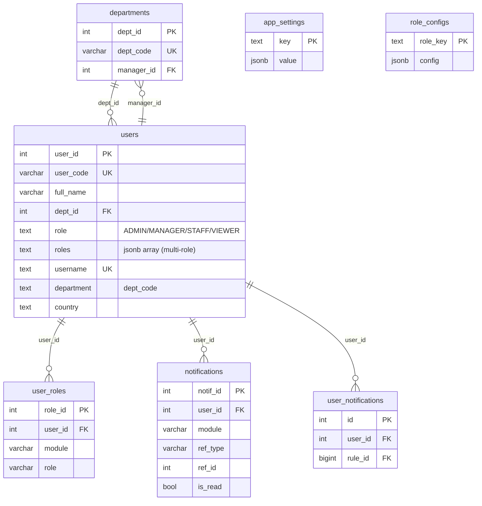

มาสเตอร์ระบบ: `app_settings` (key/value — เก็บ grace days, member master key ฯลฯ), `role_configs` (นิยาม role + permission), `automation_tasks` / `automation_steps` (sync scheduler)

---

## 3. Events

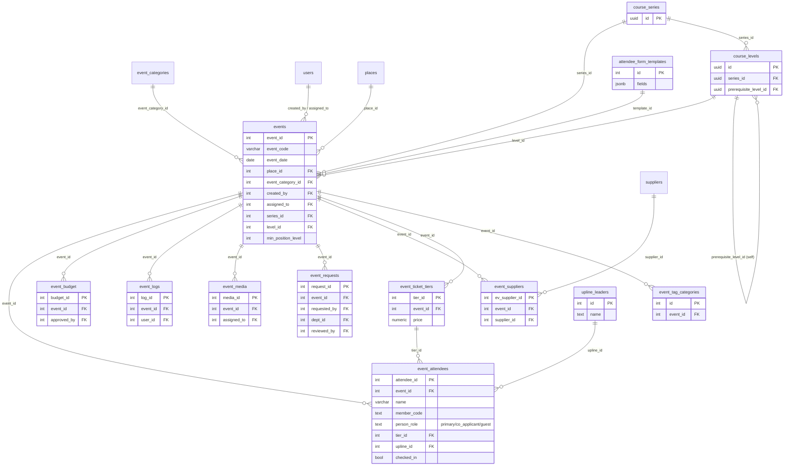

---

## 4. Places & Room Booking

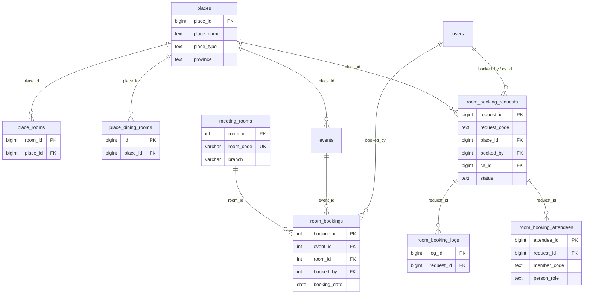

---

## 5. Trip / Tour

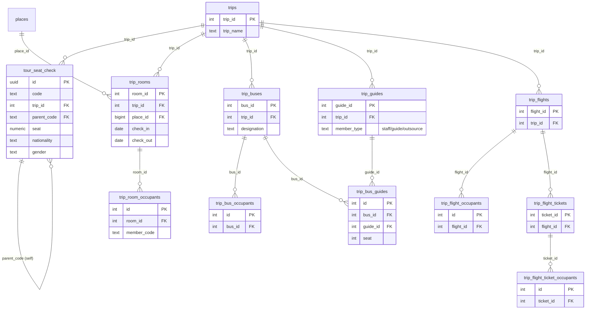

มาสเตอร์ทริป (ไม่มี FK แข็ง): `trip_airports`, `trip_flight_numbers`, `flight_masters`, `trip_report_templates`, `nationalities` (115), `member_types` (112)

---

## 6. Members (MLM)

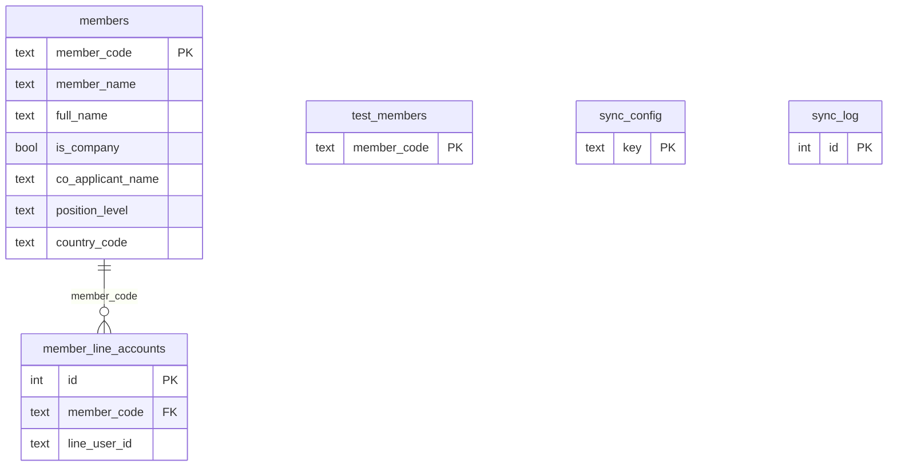

- **View `member_persons`**: แตก 1 `member_code` → 1-2 คน (primary + co_applicant) ใช้กับ dropdown ลงทะเบียน event/booking/trip
- `members` เป็น snapshot จาก sync (sync-members.js) — `event_attendees.member_code` / `room_booking_attendees.member_code` / `trip_room_occupants.member_code` อ้างถึง (soft link, ไม่ใช่ FK แข็ง)

---

## 7. LINE & FB Messaging

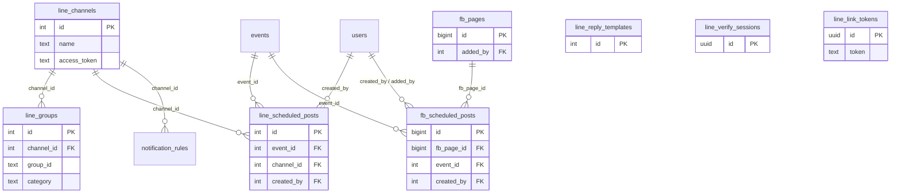

หมายเหตุ: `events` มีคอลัมน์ link กลุ่ม LINE (053) · `users.line_*` (030) เก็บ LINE binding ของพนักงาน

---

## 8. Notification

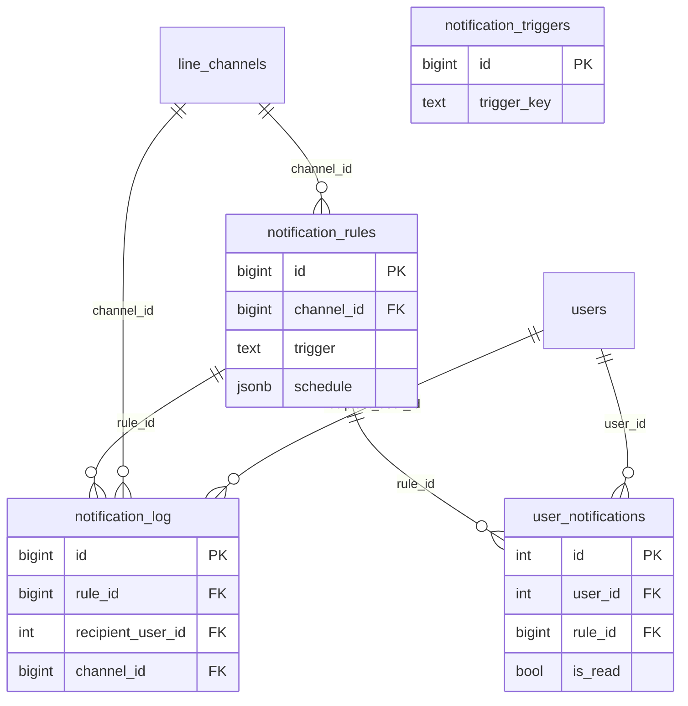

---

## 9. IBD (International Business Dept)

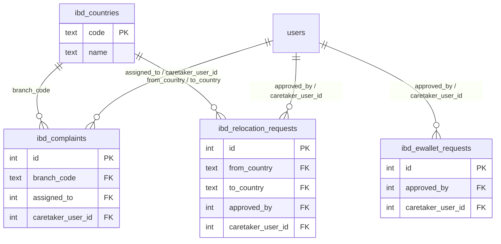

---

## 10. Daily Sale / CS

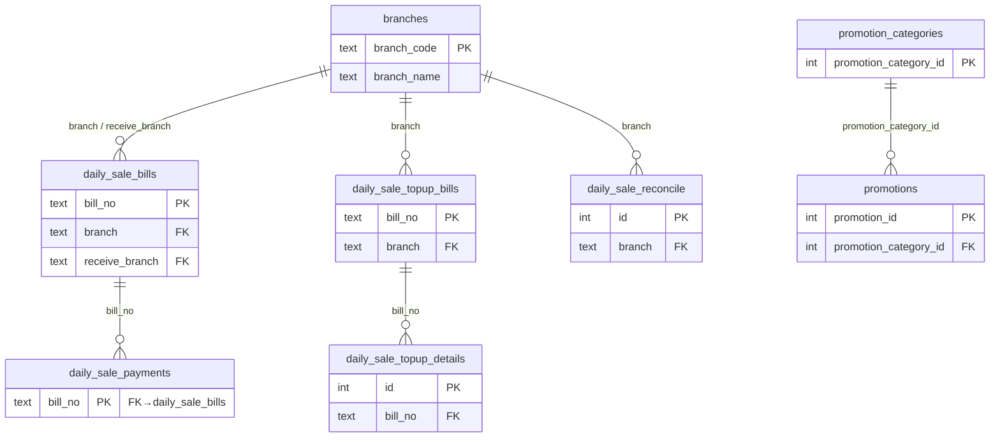

---

## 11. Work Plan & Misc

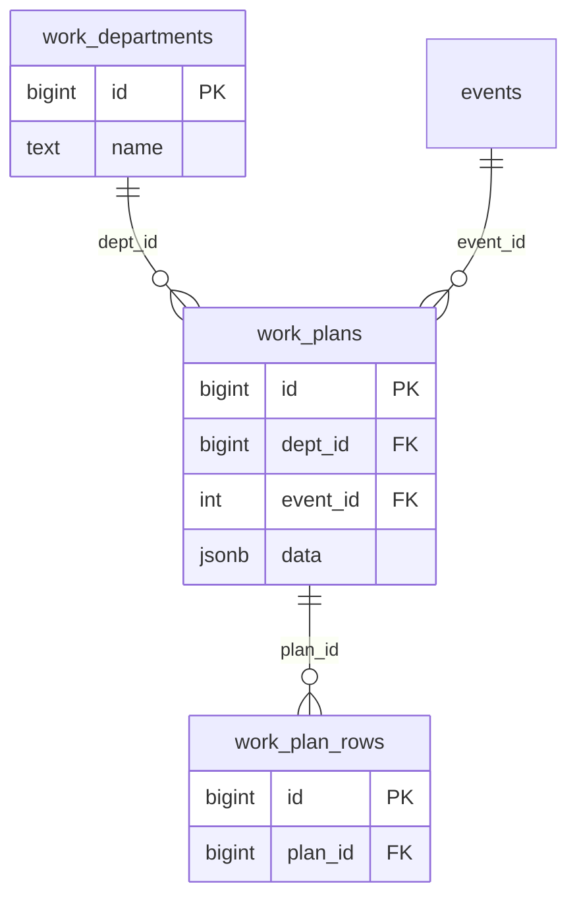

มาสเตอร์/ตารางเดี่ยวอื่น ๆ: `qr_style_presets`, `manual_chapters` → `manual_pages` (chapter_id, updated_by→users), `attendee_form_templates`

---

## สรุปจุดเชื่อมข้ามโดเมน (hub tables)

- **`users`** — ศูนย์กลาง: ถูกอ้างถึงจาก events, requisitions, PO, SO, stock, notification, ibd, line, fb, room_booking, manual ฯลฯ (created_by / assigned_to / approved_by / caretaker)
- **`events`** — เชื่อม places, room_bookings, line/fb scheduled posts, work_plans, course_series/levels, ticket_tiers, attendees
- **`places`** — เชื่อม events, place_rooms, trip_rooms, room_booking_requests
- **`member_code`** (soft link จาก `members`) — ใช้ใน event_attendees, room_booking_attendees, trip_room_occupants (ไม่ใช่ FK แข็ง เพราะ members เป็น sync snapshot)
- **`warehouses`** — เชื่อม PO, SO, requisitions, stock_movements, bins/locations/zones (+ self parent_id)
